# Terminal Widget Profile

> ⚠️ **Work in Progress** - Snake animation embedding is currently being refined

A terminal-style SVG widget for your GitHub profile. Auto-updates via GitHub Actions.

<div align="center">
  
</div>

## Quick Start

1. **Use this template** → Create repo as `YOUR_USERNAME/YOUR_USERNAME`
2. **Replace README.md** with the widget (or just use `EXAMPLE_PROFILE_README.md` as template):

   ```html
   <div align="center">
     
   </div>
   ```
3. **Edit** `scripts/config.yaml`:

   ```yaml
   username: YOUR_GITHUB_USERNAME
   theme: catppuccin  # catppuccin | nord | gruvbox | tokyo_night
   ```
4. **Enable Actions** → Run "Generate Terminal Widget" workflow
5. **Done!** Your profile updates every 6 hours

## Features

| Feature | Description |
|---------|-------------|
| 📊 **Live Stats** | Repos, stars, followers (updates every 6h) |
| 🚀 **Top Projects** | Your best repos, sorted by stars |
| 👤 **Personal Bio** | Name, tagline, website, links |
| 🎨 **4 Themes** | Catppuccin, Nord, Gruvbox, Tokyo Night |
| 🐍 **Snake Animation** | Contribution graph snake (powered by [Platane/snk](https://github.com/Platane/snk)) |
| ⚡ **Lightweight** | Pure SVG, ~7KB |

## Snake Animation

This project includes the awesome contribution snake animation by [@Platane](https://github.com/Platane). 

The workflow generates two snake files:
- `snake.svg` - Dark mode
- `snake-light.svg` - Light mode

Embed in your README with dark mode support:

```html
<picture>
  <source media="(prefers-color-scheme: dark)" srcset="snake.svg" />
  <source media="(prefers-color-scheme: light)" srcset="snake-light.svg" />
  
</picture>
```

## Configuration

Edit [`scripts/config.yaml`](scripts/config.yaml):

```yaml
username: your-username
theme: catppuccin

bio:
  name: "Your Name"
  tagline: "Developer • Open Source"
  website: "https://yoursite.com"
  links:
    - title: "LinkedIn"
      url: "https://linkedin.com/in/you"

display:
  show_bio: true
  show_stats: true
  show_projects: true
  max_projects: 4
```

## Themes

| Catppuccin | Nord | Gruvbox | Tokyo Night |
|------------|------|---------|-------------|
| `#1e1e2e` | `#2e3440` | `#282828` | `#1a1b26` |

## Docs

- [Configuration Guide](docs/CONFIGURATION.md)
- [Development & Testing](docs/DEVELOPMENT.md)
- [Troubleshooting](docs/TROUBLESHOOTING.md)
- [Updating from Upstream](docs/UPDATING.md) - Get latest fixes and features

## Credits

- Snake animation: [Platane/snk](https://github.com/Platane/snk) ❤️

## License

MIT
