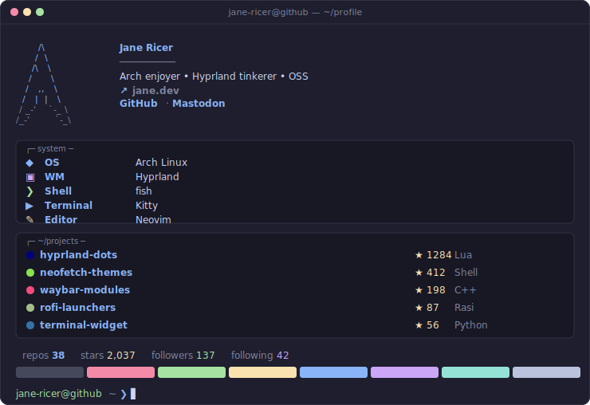
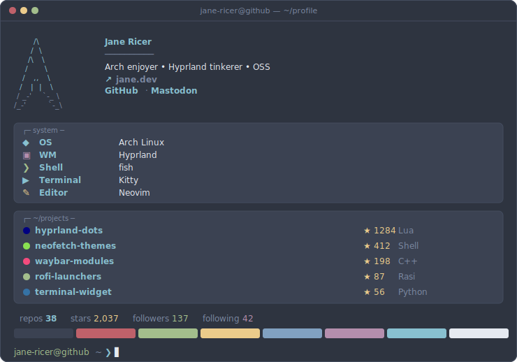
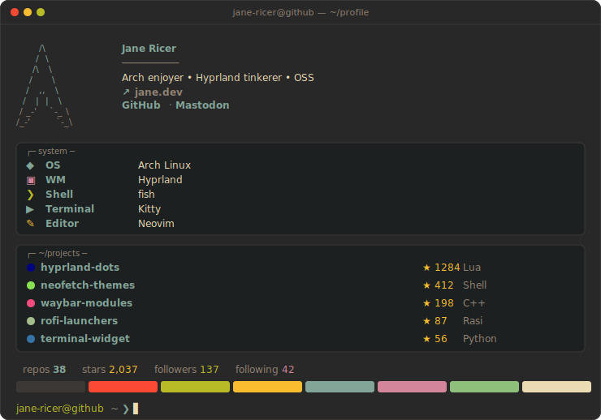
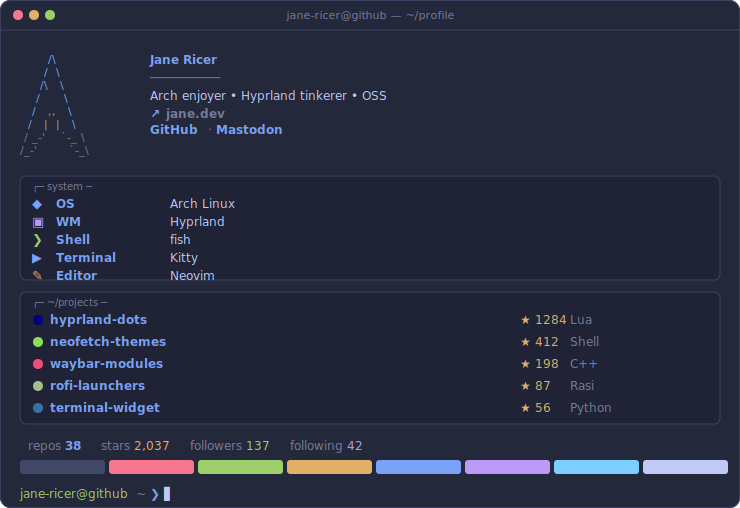
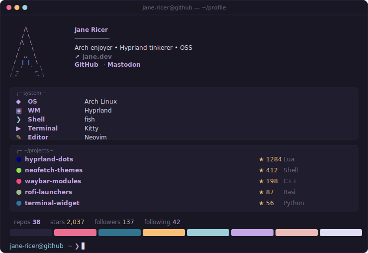
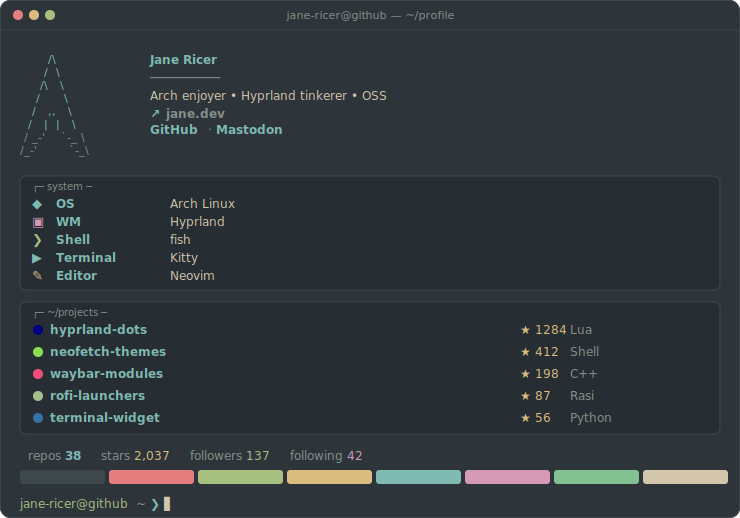

<div align="center">

# `terminal-widget-profile`

**A neofetch-style SVG widget for your GitHub profile.**
Pure SVG · zero runtime deps · auto-updates daily · 6 themes · ~6 KB.

[](https://github.com/inventory69/terminal-widget-profile/actions/workflows/generate-terminal.yml)
[](LICENSE)



</div>

---

## Quick Start

> Five steps. No PAT. No external services. Fork → edit one file → done.

1. **Use this template** → create a repo named exactly `YOUR_USERNAME/YOUR_USERNAME` (the special "profile" repo).
2. **Edit [`scripts/config.yaml`](scripts/config.yaml)** — set `username` and `bio.name`. That's the minimum.
3. **Embed it in your `README.md`:**
   ```html
   <p align="center"></p>
   ```
4. **Enable Actions** in your repo Settings → Actions → "Allow all actions".
5. **Run the workflow once** manually (Actions tab → *Generate Terminal Widget* → *Run workflow*). It will run **daily at 03:00 UTC** afterwards.

That's it. Your profile updates itself. No `GITHUB_TOKEN` setup needed — Actions provides one automatically.

## Why this widget?

Most GitHub stat widgets look like a 2021 corporate dashboard. This one is built for the people who spend their Saturdays on r/unixporn:

- 🎨 **Looks handcrafted** — neofetch-inspired layout with ASCII distro logo, two-column system fetch, language-color project dots, terminal palette bar.
- 🪶 **~6 KB** — pure SVG, no JS, no external resources, no `<foreignObject>`. Renders cleanly in GitHub's sanitiser.
- 🌈 **6 first-class themes** — Catppuccin, Nord, Gruvbox, Tokyo Night Storm, Rosé Pine, Everforest. All with proper semantic color roles.
- 🛠 **One file to edit** — everything lives in `scripts/config.yaml`. Never touch a Python file.
- 🤖 **Polite CI** — daily cron, `[skip ci]` on auto-commits, only commits when the SVG actually changed.

## Themes

| Theme | Base | |
|---|---|---|
| Catppuccin Mocha   | `#1e1e2e` |  |
| Nord               | `#2e3440` |  |
| Gruvbox            | `#282828` |  |
| Tokyo Night Storm  | `#24283b` |  |
| Rosé Pine          | `#191724` |  |
| Everforest         | `#2d353b` |  |

> Switch theme by setting `theme:` in [`scripts/config.yaml`](scripts/config.yaml).
> The legacy key `tokyo_night` is kept as an alias for `tokyo_night_storm`.

## Configuration reference

Everything is optional except `username`. Sensible defaults are applied for anything you omit.

| Field | Type | Default | Description |
|---|---|---|---|
| `username`                    | string | — *(required)* | Your GitHub login. |
| `theme`                       | string | `catppuccin`   | One of the 6 themes above. |
| `bio.name`                    | string | GitHub name    | Display name in the header. |
| `bio.tagline`                 | string | —              | One-line tagline. |
| `bio.website`                 | string | —              | URL (scheme stripped on display). |
| `bio.links[]`                 | list   | —              | `{title, url}` items, max 4 shown. |
| `fetch_fields`                | map    | sensible defaults | Cosmetic OS/WM/Shell/Terminal/Editor entries. |
| `display.show_bio`            | bool   | `true`         | Header bio block. |
| `display.show_fetch`          | bool   | `true`         | neofetch-style key/value block. |
| `display.show_stats`          | bool   | `true`         | One-line repos / stars / followers / following. |
| `display.show_projects`       | bool   | `true`         | Top repos with language-color dot. |
| `display.show_palette`        | bool   | `true`         | 8-color terminal palette bar. |
| `display.ascii_logo`          | string | `arch`         | `arch` · `cat` · `none`. |
| `display.embed_snake`         | bool   | `false`        | Inline snake animation into `terminal.svg`. |
| `display.max_projects`        | int    | `5`            | 1–10. |

## Snake animation

The contribution snake by [@Platane](https://github.com/Platane) is generated as **separate files** (`snake.svg`, `snake-light.svg`) so the main `terminal.svg` stays small.

Embed it under your widget with proper light/dark support:

```html
<picture>
  <source media="(prefers-color-scheme: dark)"  srcset="snake.svg"/>
  <source media="(prefers-color-scheme: light)" srcset="snake-light.svg"/>
  
</picture>
```

Prefer it inside the widget? Set `display.embed_snake: true` (output grows to ~80 KB).

## Local development

```bash
pip install -r requirements.txt

# render preview SVGs for every theme using mock data (no token required)
python scripts/generate_preview.py

# validate your config
python scripts/validate_config.py

# render against the real GitHub API (set GITHUB_TOKEN to avoid rate limits)
python scripts/generate_svg.py
```

Previews land in `docs/previews/preview-<theme>.svg`.

## Docs

- [Configuration guide](docs/CONFIGURATION.md)
- [Development & testing](docs/DEVELOPMENT.md)
- [Troubleshooting](docs/TROUBLESHOOTING.md)
- [Updating from upstream](docs/UPDATING.md)

## Credits

- Snake animation: [Platane/snk](https://github.com/Platane/snk)
- Color palettes: [Catppuccin](https://github.com/catppuccin), [arcticicestudio/nord](https://github.com/arcticicestudio/nord), [morhetz/gruvbox](https://github.com/morhetz/gruvbox), [folke/tokyonight.nvim](https://github.com/folke/tokyonight.nvim), [rose-pine](https://github.com/rose-pine), [sainnhe/everforest](https://github.com/sainnhe/everforest)

## License

MIT — see [LICENSE](LICENSE).
